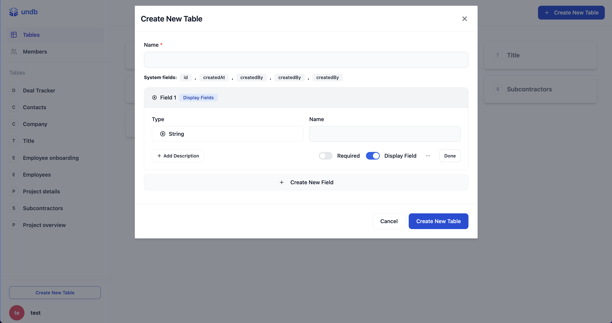
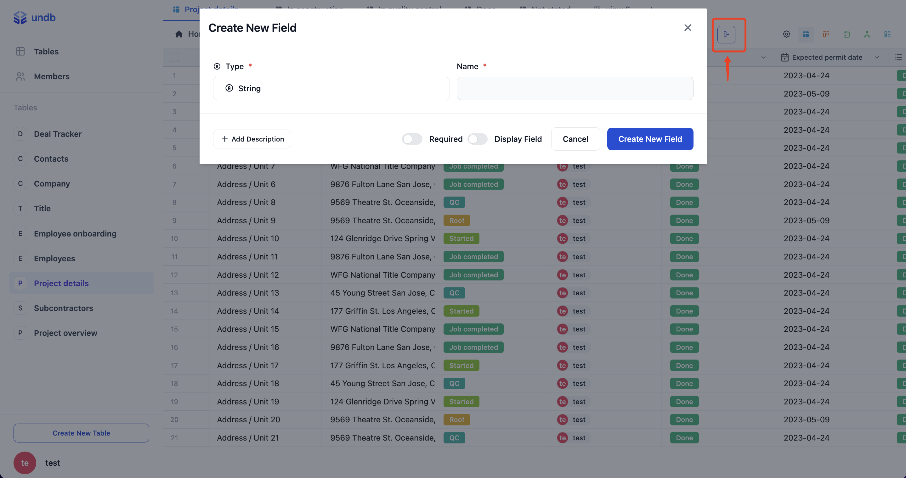

# undb


Private first, unified, self-hosted no code database.

<a href="https://demo.undb.xyz/">Live Demo</a>
·
<a href="https://docs.undb.xyz/">Documentation</a>
·
<a href="https://www.undb.xyz/">Website</a>

> use email `test@example.com` and password `123456` to login


## Features

- :closed_lock_with_key: Private first
- :balloon: Light weight, requires just one file storage by default
- :computer: Self hosted in seconds
- :pencil: Customizable
- :sparkles: Multiple built-in field types and variants
- :city_sunset: Different types of views, including grid, kanban, tree, calendar and more

## Easy creation

- Create table

  

- Create new field

  

- Create new record

  

- Create new view

  

> Please refer to the user manual for more detailed instructions on how to use. :memo: [Documentation](https://docs.undb.xyz/)

## Deploy

### Deploy with docker

```
docker run -d --name undb -p 4000:4000 --platform linux/x86_64 -v ~/.undb/:/var/opts/.undb ghcr.io/undb-xyz/undb:latest
```

> And then you can visit http://localhost:4000 and get started

### Deploy with Render.com

<a href="https://render.com/deploy?repo=https://github.com/undb-xyz/undb">
  
</a>

> You'll need a render account to deploy your own undb instance


## License

undb is open-source under the GNU Affero General Public License Version 3 (AGPLv3). You can find it [here](./LICENSE).
